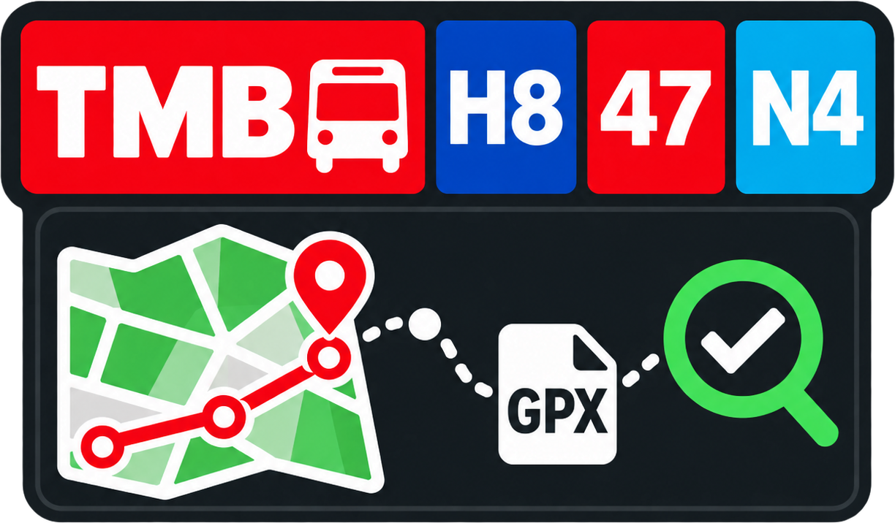

  

  <h1>TMBgpxOSM</h1>

  
Recorreguts GTFS de TMB, generació de GPX i comprovació QA amb OpenStreetMap.

  

    <a href="https://atarom.github.io/TMBgpxOSM/">
      <strong>Obre l'aplicació ↗</strong>
    </a>
  

---

Consulta les línies i sentits de TMB, visualitza recorreguts i parades, descarrega fitxers GPX per poder seguir i recórrer els itineraris sobre el terreny, i compara el GTFS oficial amb les relacions d’OpenStreetMap per detectar diferències de geometria, parades i etiquetatge.

## Tecnologies i dades

- [OpenLayers](https://openlayers.org/) — visualització del mapa i de les geometries.
- [JSZip](https://stuk.github.io/jszip/) — lectura del fitxer GTFS.
- [T-mobilitat Open Data](https://t-mobilitat.atm.cat/web/t-mobilitat/dades-obertes) — font del GTFS oficial.
- [Overpass API](https://overpass-api.de/) — cerca de relacions d’OpenStreetMap.
- [OpenStreetMap API](https://wiki.openstreetmap.org/wiki/API_v0.6) — lectura de relacions completes per a les comprovacions QA.
- [OpenStreetMap contributors](https://www.openstreetmap.org/copyright) — dades disponibles sota llicència ODbL.

